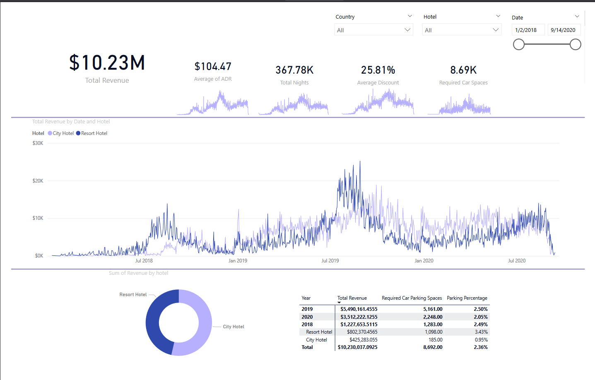

# Visualize and Analyze Hotel Bookings

[Download Dataset](https://absentdata.com/wp-content/uploads/2021/05/hotel_revenue_historical_full-2.xlsx)

## Goals

1. Is hotel revenue growing by year ?
2. Should we increase the parking lot size ?
3. What trends can we see in the data ?

## Tools

- Microsoft SQL Server
- Microsoft SQL Server Management Studio
- Microsoft Power Bi

## Tasks

- [X] Build a Database
- [X] Analuze and Retrieve Data with SQL
- [X] Connect Power BI to Database
- [X] Visualize Data in Power BI
